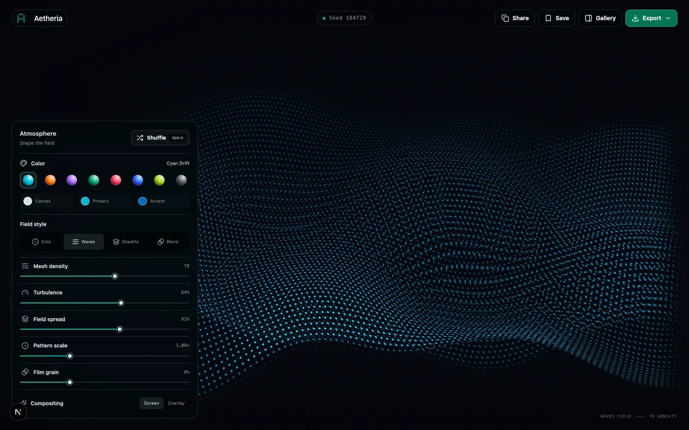

<div align="center">
  
  <h1>Aetheria</h1>
  <p><strong>Generative backgrounds, tuned by hand.</strong></p>
  <p>A fast, installable WebGL studio for creating cinematic backgrounds for apps, websites, presentations, and desktops.</p>
  <p><code>v0.1.0</code> · Next.js 16 · React 19 · WebGL 2 · Bun</p>
</div>



## What it does

- Renders four GPU-native styles: fluid halftone **Dots**, perspective particle-mesh **Waves**, contour-strand **Sheaths**, and a layered **Blend**.
- Offers eight curated palettes plus independent canvas, primary, and accent color controls.
- Shuffles instantly from deterministic seeds and reproduces every setup from a shareable URL.
- Saves exact seeds and rendered previews in local browser storage.
- Exports lossless 4K, 5K, and 9:16 mobile PNGs through an off-screen WebGL buffer.
- Installs as a standalone PWA and keeps the studio shell available offline after the first visit.

## Install the app

Visit **[Aetheria](https://sethmed7.github.io/aetheria/)** over HTTPS, then use your browser’s install action:

- **Chrome / Edge:** click the install icon in the address bar or choose **Install Aetheria** from the browser menu.
- **Safari on macOS:** choose **File → Add to Dock**.
- **iPhone / iPad:** open the Share sheet and choose **Add to Home Screen**.
- **Android:** choose **Install app** or **Add to Home screen** from the browser menu.

The installed app opens in its own window. Artwork, saved seeds, sharing, and high-resolution exports remain local to your device.

## Run locally

```bash
bun install
bun dev
```

Open the local URL printed by Next.js. Press `Space` to shuffle and `G` to open the saved gallery.

## Build and verify

```bash
bun run lint
bun run build
```

To generate the static PWA used by GitHub Pages:

```bash
STATIC_EXPORT=true NEXT_PUBLIC_BASE_PATH=/aetheria bun run build
```

The export is written to `out/`. Every push to `main` runs lint, builds this export, and deploys it through GitHub Actions.

## Rendering architecture

The rendering engine lives in [`lib/engine.ts`](lib/engine.ts). A persistent WebGL 2 context draws a single full-screen triangle and evaluates the selected composition in one fragment-shader pass. Parameter changes update uniforms instead of rebuilding the renderer, keeping sliders and shuffle responsive.

The same engine powers the live canvas, deterministic gallery thumbnails, and off-screen exports. The primary controls are:

| Parameter | Purpose |
| --- | --- |
| `seed` | Deterministic composition source |
| `curves` | Particle or strand density |
| `turbulence` | Strength of field deformation |
| `spread` | Width and tonal range |
| `thickness` | Dot or strand scale |
| `grain` | Procedural dithering intensity |
| `palette` | Curated or custom color system |
| `renderMode` | `dots`, `waves`, `sheaths`, or `blend` |

High-resolution PNG generation is isolated in [`lib/export.ts`](lib/export.ts). PWA metadata is defined in [`app/manifest.ts`](app/manifest.ts), with a versioned offline shell in [`public/sw.js`](public/sw.js).

## Browser support

Aetheria requires WebGL 2 and works best in current Chrome, Edge, Firefox, and Safari. It respects reduced-motion preferences and displays a clear compatibility message when WebGL 2 is unavailable.

## License

[MIT](LICENSE)
