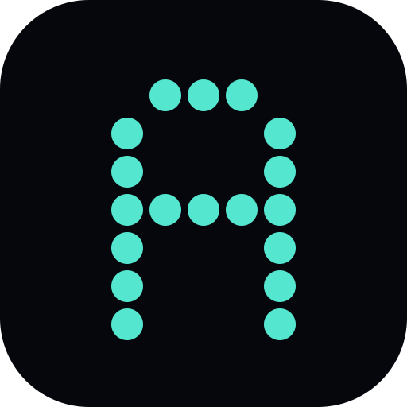

<div align="center">
  
  <h1>Aetheria</h1>
  <p><strong>Generative backgrounds, tuned by hand.</strong></p>
  <p>A free, installable WebGL studio for cinematic backgrounds.</p>
  <p><a href="https://aetheria.sethmedina.com"><strong>Open Aetheria</strong></a></p>
  <p><code>v0.2.0</code> · Next.js 16 · React 19 · WebGL 2 · Bun · MIT</p>
</div>

## What it does

- Renders one focused GPU-native style: fluid, domain-warped halftone **Dots**.
- Offers eight curated palettes plus independent canvas, primary, and accent color controls.
- Adds centered custom typography with four export-safe font styles and an independent text color.
- Shuffles instantly from deterministic seeds and reproduces every setup from a shareable URL.
- Saves exact seeds and rendered previews in local browser storage.
- Exports lossless 4K, 5K, and 9:16 mobile PNGs through an off-screen WebGL buffer.
- Installs as a standalone PWA and keeps the studio shell available offline after the first visit.

Everything runs locally in the browser. Aetheria has no accounts, uploads, tracking, or server-side rendering pipeline.

## Use Aetheria

Visit **[aetheria.sethmedina.com](https://aetheria.sethmedina.com)** to:

1. Download one of six free 4K starter backgrounds.
2. Open a starter in the studio and make it your own.
3. Export a desktop or mobile PNG without uploading your work.

## Install the app

Open the [Aetheria studio](https://aetheria.sethmedina.com/studio) over HTTPS, then use your browser’s install action:

- **Chrome / Edge:** click the install icon in the address bar or choose **Install Aetheria** from the browser menu.
- **Safari on macOS:** choose **File → Add to Dock**.
- **iPhone / iPad:** open the Share sheet and choose **Add to Home Screen**.
- **Android:** choose **Install app** or **Add to Home screen** from the browser menu.

The installed app opens in its own window. Artwork, saved seeds, sharing, and high-resolution exports remain local to your device.

## Run locally

```bash
bun install
bun dev
```

Open the local URL printed by Next.js. Press `Space` to shuffle and `G` to open the saved gallery.

## Verify

```bash
bun run lint
bun run build
```

To generate a portable static build:

```bash
STATIC_EXPORT=true NEXT_PUBLIC_BASE_PATH=/aetheria bun run build
```

The export is written to `out/`. The production app is configured through [`railway.json`](railway.json). Pull requests run lint plus both production and static builds in GitHub Actions.

## Architecture

The rendering engine lives in [`lib/engine.ts`](lib/engine.ts). A persistent WebGL 2 context draws a single full-screen triangle and evaluates the selected composition in one fragment-shader pass. Parameter changes update uniforms instead of rebuilding the renderer, keeping sliders and shuffle responsive.

The same engine powers the live canvas, deterministic gallery thumbnails, and off-screen exports. The primary controls are:

| Parameter | Purpose |
| --- | --- |
| `seed` | Deterministic composition source |
| `curves` | Halftone dot density |
| `turbulence` | Strength of field deformation |
| `spread` | Width and tonal range |
| `thickness` | Dot scale |
| `grain` | Procedural dithering intensity |
| `palette` | Curated or custom color system |
| `text` | Optional centered title, defaulting to `DO MORE` |
| `textFont` | Grotesk, serif, mono, or rounded font style |
| `textColor` | Independent title color |

High-resolution PNG generation is isolated in [`lib/export.ts`](lib/export.ts). PWA metadata is defined in [`app/manifest.ts`](app/manifest.ts), with a versioned offline shell in [`public/sw.js`](public/sw.js).

## Browser support

Aetheria requires WebGL 2 and works best in current Chrome, Edge, Firefox, and Safari. It respects reduced-motion preferences and displays a clear compatibility message when WebGL 2 is unavailable.

## Contributing

Contributions are welcome. Read [`CONTRIBUTING.md`](CONTRIBUTING.md) before opening a pull request. Use GitHub Issues for reproducible bugs and focused feature proposals.

For security issues, follow the private reporting process in [`SECURITY.md`](SECURITY.md).

## License

[MIT](LICENSE) © Seth Medina.
